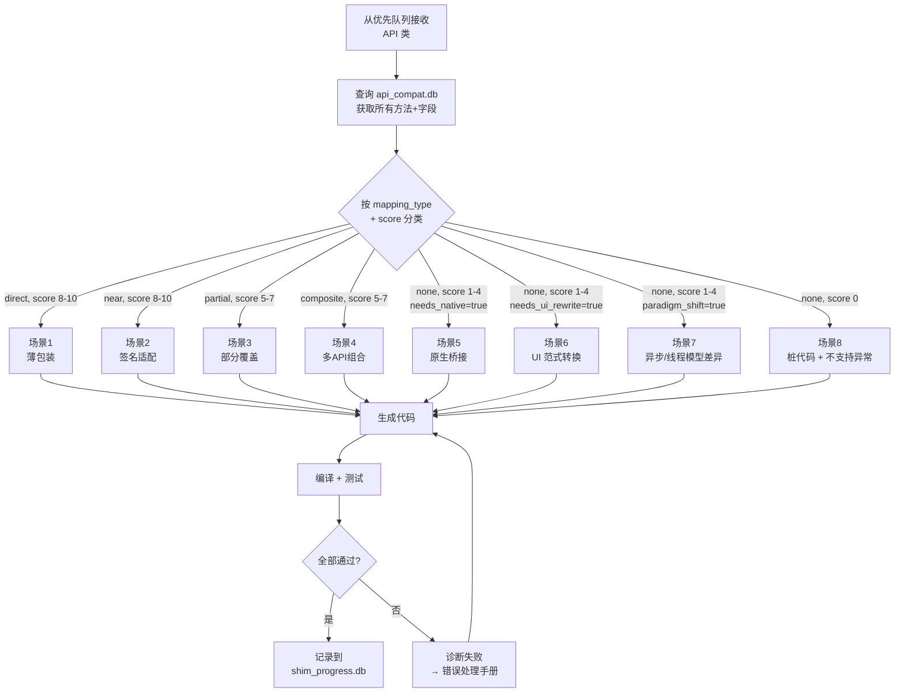
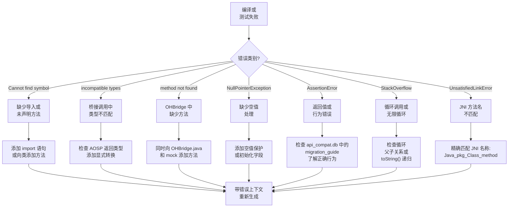

# AI 代理操作手册：逐 API 适配代码生成

## 目的

本文档为 AI 编码代理提供**逐场景的详细指令**，用于生成 Android→OHOS 适配（shim）代码。针对代理遇到的每种 API 模式，本手册指定：生成什么、如何测试、需要注意的陷阱、以及如何自我修正。

现有 `02-SHIM-BUILD-PLAN.md` 描述了*做什么*和*何时做*。本手册描述*怎么做*——AI 代理在处理每个 API 时所遵循的详细决策树。

---

## 决策树：每个 API 的处理流程



---

## 场景 1：直接映射（薄包装）

**条件：** `mapping_type = 'direct'`, `score >= 8`, `return_type_match = true`, `param_compatibility >= 0.9`

**代理在数据库中看到的：**
```
android.util.Log.d(String, String) → hilog.debug(domain, tag, format)  score=9  direct
```

**需要生成的内容：**

1. **Java 适配类** — 委托给 `OHBridge.nativeXxx()`：
```java
package android.util;
import com.ohos.shim.bridge.OHBridge;

public class Log {
    public static int d(String tag, String msg) {
        OHBridge.logDebug(tag, msg);
        return 0;
    }
    // ... 所有10个日志方法
}
```

2. **OHBridge 声明** — 添加 `static native` 方法
3. **Mock OHBridge** — JVM 测试用的内存模拟
4. **测试用例** — 在 HeadlessTest.java 中

**陷阱：**
- 空参数：Android Log 可以接受 null tag/msg，适配层也必须支持
- 返回值：Android Log.d 返回 int（写入字节数），适配层返回 0（模拟）
- 线程安全：Log 必须在任何线程上安全调用

**自我修正触发条件：**
| 错误 | 修复方法 |
|------|---------|
| `NullPointerException` | 在 mock 实现中添加空值保护 |
| 返回类型不匹配 | 检查 AOSP 返回类型，精确匹配 |
| 缺少重载方法 | 检查所有重载版本（tag+msg, tag+msg+throwable） |

**测试级别：** 仅第1级（Mock），无需 OHOS 运行时。

**预期迭代次数：** 1 次（首次成功率>95%）

---

## 场景 2：签名适配（近似映射）

**条件：** `mapping_type = 'near'`, `score >= 8`, `param_compatibility >= 0.7`

**关键区别：** 参数顺序、类型或数量不同。可能需要类型转换。

**类型转换对照表：**

| Android 类型 | OH 类型 | 转换代码 |
|---|---|---|
| `int` 颜色 `0xFFRRGGBB` | `string` `'#AARRGGBB'` | `String.format("#%08X", color)` |
| `float` dp | `number` vp | `(float) dpValue`（标准密度下 1:1） |
| `Enum`（int 常量） | `string` 枚举 | switch/map 查找 |
| `long` 时间戳 ms | `number` 时间戳 ms | `(long) value` |
| `byte[]` | `Uint8Array` | 桥接层处理缓冲区拷贝 |
| `Parcelable` | `Record<string, Object>` | 通过桥接层 JSON 序列化 |

**陷阱：**
- 整数溢出：Android 许多地方用 int，OH 用 number（double）
- 颜色格式：Android ARGB int 与 OH `#AARRGGBB` 字符串或 `Color.XXX` 枚举
- 密度：dp/sp/vp 单位在不同设备上可能不同；默认 1:1

**测试级别：** 第1级（Mock）。

**预期迭代次数：** 1-2 次

---

## 场景 3：部分覆盖

**条件：** `mapping_type = 'partial'`, `score 5-7`，部分方法无 OH 对应

**决策规则：** 实现 score >= MIN_SCORE 的方法，其余用桩代码。

**桩代码策略决策表：**

| 桩行为 | 使用场景 | 示例 |
|---|---|---|
| `throw UnsupportedOperationException` | API 无对应且静默忽略会导致问题 | `requestNetwork()` |
| 返回安全默认值（空操作） | API 无对应但可安全忽略 | `bindProcessToNetwork()` → return true |
| 返回空值/null | 查询 API 但无数据源 | `getNetworkCapabilities()` 返回 null |
| 记录警告 + 空操作 | 信息性 API | `reportNetworkConnectivity()` |

**陷阱：**
- 不要静默桩代码。始终记录日志或抛出异常——静默桩会导致后续无法调试的问题
- 检查应用是否实际调用了桩方法。如果在未使用的代码路径中，桩代码没问题；如果在关键路径中，标记为需要人工审查
- 在类的 javadoc 中记录每个桩方法及其 OH 迁移替代方案

**测试级别：** 第1级（Mock）+ 第2级（工作方法用无头测试）。

**预期迭代次数：** 2-3 次

---

## 场景 4：多 API 组合（复合映射）

**条件：** `mapping_type = 'composite'`, `score 5-7`，一个 Android API 需要多个 OH API 调用

**组合模式对照表：**

| Android 模式 | OH 对应 | 组合策略 |
|---|---|---|
| `Intent` + extras | `Want` + `wantParams` | 映射 extras 到 params，映射 actions |
| `Activity.startActivityForResult()` | `UIAbility.startAbilityForResult()` | 用 Promise 包装回调 |
| `ContentResolver.query()` + Cursor | `DataShareHelper.query()` + ResultSet | 适配谓词 + 列名 |
| `AlarmManager.setExact()` | `reminderAgentManager.publishReminder()` | 从闹钟参数构建 ReminderRequest |
| `PendingIntent.getActivity()` | `WantAgent.getWantAgent()` | 从 Intent 构建 WantAgentInfo |
| `BroadcastReceiver` + IntentFilter | `commonEventManager.subscribe()` | 映射 filter actions 到事件名称 |

**陷阱：**
- Intent flags（FLAG_ACTIVITY_NEW_TASK 等）无直接 OH 对应——需映射到 launchType
- Bundle/extras 嵌套对象：Android 支持 Parcelable bundle 内嵌 bundle
- Intent 上的 URI 数据：`setData(Uri)` 映射到 `want.uri`
- 隐式 Intent（无目标类）：OH 使用"skills"匹配，而非 intent-filter

**测试级别：** 第1级（Mock）+ 第2级（生命周期测试用无头测试）。

**预期迭代次数：** 2-3 次

---

## 场景 5：需要原生桥接

**条件：** `needs_native = true`, `score 3-7`，OH API 仅通过 C/C++ NDK 可访问

**关键桥接类型编排规则：**

| Java→JNI→Rust 方向 | 规则 |
|---|---|
| `String` → `jstring` | 使用 `env.get_string()`，处理 UTF-8 |
| `null` String | 返回 `env.new_string("")` 或 `JObject::null()` |
| `int` → `jint` | 直接转换 i32 |
| `byte[]` → `jbyteArray` | 使用 `env.convert_byte_array()`，管理生命周期 |
| `Object` → `jobject` | 必须通过 JNI `new_object()` 创建 Java 对象 |
| Callback → `jobject` | 存储为 GlobalRef，通过 `call_method()` 调用 |

**陷阱：**
- 静态 final 字段从 native 初始化：如果 JNI 失败，字段为 null → 到处 NPE
- JNI 线程安全：`JNIEnv` 是线程本地的，绝不能跨线程共享
- 内存：JNI 本地引用有限（~512），在循环中使用 `DeleteLocalRef`

**测试级别：** 第1级（Mock）用于 JVM，第3级（QEMU）用于真实原生调用。

**预期迭代次数：** 2-4 次

---

## 场景 6：UI 范式转换

**条件：** `needs_ui_rewrite = true`，类在 `android.widget.*` 或 `android.view.*` 中

**策略：视图描述树**

适配层不创建真实 UI。它构建一个数据结构（ViewTree），ArkUI 渲染器可以读取。

**属性映射表**（代理必须严格遵循）：

| Android Setter | ViewNode 属性键 | 值类型 | ArkUI 对应 |
|---|---|---|---|
| `setText(CharSequence)` | `"text"` | String | `.label('text')` 或 `Button('text')` |
| `setTextColor(int)` | `"fontColor"` | String `#AARRGGBB` | `.fontColor(color)` |
| `setTextSize(float)` | `"fontSize"` | Number (fp) | `.fontSize(n)` |
| `setBackgroundColor(int)` | `"backgroundColor"` | String `#AARRGGBB` | `.backgroundColor(color)` |
| `setVisibility(int)` | `"visibility"` | `"Visible"/"Hidden"/"None"` | `.visibility(...)` |
| `setPadding(l,t,r,b)` | `"padding"` | `{left,top,right,bottom}` | `.padding({...})` |
| `setWidth(int)` | `"width"` | Number (vp) 或 `"100%"` | `.width(n)` |
| `setHeight(int)` | `"height"` | Number (vp) 或 `"100%"` | `.height(n)` |
| `setEnabled(boolean)` | `"enabled"` | Boolean | `.enabled(b)` |
| `setAlpha(float)` | `"opacity"` | Number 0-1 | `.opacity(f)` |
| `setOnClickListener(l)` | `"onClick"` | callback ref | `.onClick(()=>...)` |

**布局映射**（容器）：

| Android 容器 | ViewNode 类型 | ArkUI 组件 | 关键行为 |
|---|---|---|---|
| `LinearLayout(VERTICAL)` | `"Column"` | `Column()` | 子元素垂直堆叠 |
| `LinearLayout(HORIZONTAL)` | `"Row"` | `Row()` | 子元素水平排列 |
| `FrameLayout` | `"Stack"` | `Stack()` | 子元素叠加（z 顺序） |
| `ScrollView` | `"Scroll"` | `Scroll()` | 单子元素，可滚动 |
| `RecyclerView` | `"List"` | `List() { LazyForEach }` | 虚拟化，需要数据源 |
| `RelativeLayout` | `"RelativeContainer"` | `RelativeContainer()` | 基于约束 |

**陷阱：**
- `match_parent` / `wrap_content`：Android 布局参数与 ArkUI 不是1:1
  - `match_parent` → `.width('100%')` 或 `.layoutWeight(1)`
  - `wrap_content` → 省略 width/height（ArkUI 默认适应内容）
- `layout_weight` → `flexGrow`
- `gravity` 与 `layout_gravity`：子元素对齐 vs 自身对齐
- `RecyclerView.Adapter`：范式转换——必须变成 `LazyForEach` 的数据源
- View IDs：`R.id.xxx` → ArkUI 不适用（使用 @State 绑定）
- `findViewById()`：ArkUI 中不存在——状态是数据源

**测试级别：** 第1级（Mock ViewNode 创建）+ 第2级（无头 ArkUI 组件测试）。

**预期迭代次数：** 3-5 次

---

## 场景 7：异步/线程范式差异

**条件：** `paradigm_shift = true`，Android 使用同步/回调模式，OH 使用 Promise/async

**常见情况：**
- `android.os.Handler` / `Looper`（线程消息队列）→ OH `TaskPool` / `EventRunner`
- `android.os.AsyncTask` → OH `taskpool.execute()` 或 `Promise`
- `android.content.ContentResolver.query()`（同步）→ OH `DataShareHelper.query()`（异步）
- `android.media.MediaPlayer`（同步状态机）→ OH `AVPlayer`（异步状态转换）

**陷阱：**
- 死锁：如果 Android 代码从等待结果的同一线程发送到 Handler
- 线程池耗尽：AsyncTask 默认线程池为 4 个线程，部分应用可能启动数百个
- `Looper.getMainLooper()`：必须返回单例；许多 Android 应用依赖此行为
- `Message.obtain()` 池：Android 回收 Message 对象；适配层至少不能崩溃
- `Handler.Callback`：部分应用使用回调式而非子类化

**测试级别：** 第1级（Mock）带并发压力测试。

**预期迭代次数：** 3-5 次

---

## 场景 8：无映射（桩代码）

**条件：** `score = 0` 或 `score <= 2` 且 `mapping_type = 'none'`

**决策：抛出异常 vs 空操作 vs 返回默认值：**

| 方法类型 | 策略 | 示例 |
|---|---|---|
| 生命周期（create/destroy） | 空操作，返回空对象 | `create()` 返回空实例 |
| 计算（实际工作） | 抛出异常 | `createAllocation()` 抛出异常 |
| 查询（读取状态） | 返回安全默认值 | `isAvailable()` 返回 false |
| 设置器（写入状态） | 记录警告 + 空操作 | `setParam()` 记录日志并忽略 |
| 监听器注册 | 存储但永不触发 | `setCallback()` 存储但无事件 |

**测试级别：** 仅第1级（验证不崩溃，预期异常）。

**预期迭代次数：** 1 次

---

## 错误诊断手册

编译或测试失败时，代理必须诊断错误类别并应用正确的修复：



### 错误反馈提示词模板

当代理需要自我修正时，将以下内容追加到原始提示词：

```
## 上次尝试失败

### 编译错误：
{javac 的 stderr}

### 测试失败：
{测试运行器的 stdout，显示断言失败}

### 错误类别：{自动检测的类别}

### 修复指导：
- {基于错误类别的具体修复指令}

### 重要：
- 不要从头重写整个类
- 只修复特定错误
- 保持所有现有工作代码不变
- 展示需要的最小 diff
```

### 最大重试策略

| 迭代 | 策略 |
|---|---|
| 第1次尝试 | 从模板 + 数据库上下文生成 |
| 第2次尝试 | 将编译错误添加到提示词 |
| 第3次尝试 | 添加测试失败 + 数据库中的 migration_guide |
| 第4次尝试 | 添加现有工作适配代码作为参考模式 |
| 第5次尝试 | 标记为需要人工审查，跳到下一个类 |

---

## 按子系统速查表

### 数据存储 API

| 类 | 场景 | 关键规则 | 测试重点 |
|---|---|---|---|
| `SharedPreferences` | 场景1（直接） | RULE-D6: `apply()` → `put()+flush()` | CRUD、空键、并发访问 |
| `SharedPreferences.Editor` | 场景4（组合） | 链式模式: `edit().putX().apply()` | 方法链、commit vs apply |
| `SQLiteDatabase` | 场景2（近似） | RULE-D1: `rawQuery()` → `querySql()` | CRUD、事务、迁移 |
| `SQLiteOpenHelper` | 场景4（组合） | RULE-D1: 构造函数+onCreate → getRdbStore | 版本升级、打开/关闭 |
| `Cursor` | 场景2（近似） | RULE-D3: `moveToFirst/Next` → `goToFirstRow/NextRow` | 迭代、列类型、关闭 |
| `ContentValues` | 场景1（直接） | RULE-D2: → 普通对象 `{k:v}` | 所有值类型、空值 |
| `ContentProvider` | 场景4（组合） | RULE-D7: → DataShareExtensionAbility | URI 匹配、CRUD 操作、注册 |
| `ContentResolver` | 场景4（组合） | RULE-D8: → DataShareHelper | query/insert/update/delete |

### 生命周期 API

| 类 | 场景 | 关键规则 | 测试重点 |
|---|---|---|---|
| `Activity` | 场景4（组合） | R1-R9: → UIAbility + Page | 生命周期顺序、状态保存/恢复 |
| `Service` | 场景4（组合） | → ServiceExtensionAbility | 启动/停止、绑定、后台 |
| `BroadcastReceiver` | 场景4（组合） | → commonEventManager.subscribe() | 注册/取消注册、事件匹配 |
| `Application` | 场景2（近似） | → AbilityStage | 单次初始化、全局状态 |
| `Intent` | 场景4（组合） | → Want + wantParams | Action 映射、extras、URI 数据 |
| `PendingIntent` | 场景4（组合） | → WantAgent | 获取/取消、不可变标志 |

### 网络 API

| 类 | 场景 | 关键规则 | 测试重点 |
|---|---|---|---|
| `HttpURLConnection` | 场景4（组合） | → http.createHttp() | GET/POST、headers、响应码 |
| `URL` | 场景2（近似） | → string URL | 解析、协议、主机、路径 |
| `ConnectivityManager` | 场景3（部分） | → connection 模块 | 活动网络、回调、桩代码 |
| `WifiManager` | 场景3（部分） | → wifiManager 模块 | 状态、扫描、桩配置 |
| `Socket` | 场景4（组合） | → socket.constructTCPSocket() | 连接、读、写、关闭 |
| `WebSocket` | 场景4（组合） | → webSocket.createWebSocket() | 连接、发送、接收、关闭 |

### 多媒体 API

| 类 | 场景 | 关键规则 | 测试重点 |
|---|---|---|---|
| `MediaPlayer` | 场景7（异步） | 状态机: idle→prepared→playing | 状态转换、错误处理 |
| `AudioManager` | 场景3（部分） | → audio.AudioManager | 音量、铃声模式、桩代码 |
| `MediaRecorder` | 场景7（异步） | → AVRecorder + config | 录制/停止/释放 |
| `SoundPool` | 场景4（组合） | → AudioRenderer | 加载、播放、卸载 |
| `Camera2` | 场景5（原生） | → @ohos.multimedia.camera | 拍照、预览、关闭 |

### UI/Widget API

| 类 | 场景 | 关键规则 | 测试重点 |
|---|---|---|---|
| `View` | 场景6（UI） | → ViewNode 基类 | 所有通用属性 |
| `ViewGroup` | 场景6（UI） | → 带子元素的 ViewNode | addView、removeView、子元素迭代 |
| `Button` | 场景6（UI） | → Button 组件 | text、onClick、enabled |
| `TextView` | 场景6（UI） | → Text 组件 | text、color、size、lines、ellipsis |
| `EditText` | 场景6（UI） | → TextInput 组件 | hint、inputType、text change |
| `ImageView` | 场景6（UI） | → Image 组件 | src、scaleType |
| `LinearLayout` | 场景6（UI） | → Column/Row | orientation、weight、gravity |
| `FrameLayout` | 场景6（UI） | → Stack | 子元素叠加、对齐 |
| `ScrollView` | 场景6（UI） | → Scroll | 单子元素、滚动位置 |
| `RecyclerView` | 场景6（UI） | → List + LazyForEach | adapter→数据源范式转换 |
| `CheckBox` | 场景6（UI） | → Checkbox | 选中状态、onChange |
| `Switch` | 场景6（UI） | → Toggle | 开关状态、onChange |
| `ProgressBar` | 场景6（UI） | → Progress | value、indeterminate |

### 设备/系统 API

| 类 | 场景 | 关键规则 | 测试重点 |
|---|---|---|---|
| `Build` | 场景5（原生） | → deviceInfo NDK | 所有字段填充 |
| `SystemClock` | 场景2（近似） | → systemDateTime | 单调递增、运行时间 |
| `Environment` | 场景3（部分） | → 文件系统 API | 外部存储、数据目录 |
| `TelephonyManager` | 场景3（部分） | → @ohos.telephony | 电话状态、运营商、桩代码 |
| `SensorManager` | 场景4（组合） | → @ohos.sensor | 注册/取消注册、事件 |
| `LocationManager` | 场景4（组合） | → @ohos.geoLocationManager | 最后已知位置、更新、权限 |
| `Vibrator` | 场景2（近似） | → @ohos.vibrator | 振动、取消 |
| `PowerManager` | 场景3（部分） | → screenLock 模块 | 唤醒锁桩代码 |

---

## 质量关卡

代理将一个类标记为"完成"之前，必须通过所有适用的关卡：

### 关卡 1：编译（必须）
- 零编译错误
- 零关于弃用或不安全操作的警告

### 关卡 2：API 表面完整性
```
对于 AOSP 版本中该类的每个公共方法：
  - 如果 score >= MIN_SCORE：方法必须有实现（不能只是桩代码）
  - 如果 score < MIN_SCORE：方法必须存在为桩代码（throw 或 no-op）
  - 不允许完全缺少任何方法
```

### 关卡 3：测试覆盖
```
对于每个已实现（非桩代码）的方法：
  - 至少1个测试用例使用有效输入调用它
  - 至少1个测试用例使用边界输入（null、空、边界值）
  - 返回值或副作用通过断言验证
```

### 关卡 4：无回归
```
运行完整测试套件（不仅是新测试）：
  - test_pass >= baseline_pass
  - test_fail <= baseline_fail + 2（允许小的 mock 容差）
```

### 关卡 5：Mock 一致性
```
对于每个新的 OHBridge 方法：
  - 声明存在于 shim/java/.../OHBridge.java
  - Mock 存在于 test-apps/mock/.../OHBridge.java
  - Mock 返回合理的值（除非明确测试空值，否则不返回 null）
```

---

## 提示词构建算法

```python
def build_prompt(android_class: str, min_score: int) -> str:
    # 1. 从 api_compat.db 获取该类的所有方法
    apis = db.query("""
        SELECT a.name, a.signature, a.kind,
               m.score, m.mapping_type, m.effort_level,
               m.gap_description, m.migration_guide,
               m.code_example_android, m.code_example_oh,
               m.needs_native, m.needs_ui_rewrite, m.paradigm_shift,
               oa.name as oh_name, oa.signature as oh_sig
        FROM api_mappings m
        JOIN android_apis a ON m.android_api_id = a.id
        ...
        WHERE class = ? AND a.kind IN ('method','constructor')
    """, android_class)

    # 2. 确定主要场景
    scenario = classify_scenario(apis)

    # 3. 选择正确的提示词模板
    template = TEMPLATES[scenario]

    # 4. 用数据库字段丰富内容
    prompt = template.format(
        class_name=android_class,
        api_table=format_api_table(apis),
        gap_descriptions=collect_gaps(apis),
        migration_guides=collect_guides(apis),
        code_examples=collect_examples(apis),
        existing_shim=read_file_if_exists(shim_path(android_class)),
        existing_bridge=read_file_if_exists(bridge_path(android_class)),
        dependent_shims=get_already_shimmed_deps(android_class),
        min_score=min_score,
        baseline_pass=get_baseline_pass(),
        baseline_fail=get_baseline_fail(),
    )

    # 5. 如果是重试，追加错误上下文
    if previous_error:
        prompt += ERROR_FEEDBACK_TEMPLATE.format(
            compilation_error=previous_stderr,
            test_failure=previous_stdout,
            error_category=diagnose_error(previous_stderr, previous_stdout),
        )

    return prompt
```

---

## 成本估算

| 场景 | 平均 Token/类 | 平均迭代次数 | 估计成本/类 |
|---|---|---|---|
| 场景1 直接 | 3,000 入 + 2,000 出 | 1.0 | ~$0.05 |
| 场景2 近似 | 4,000 入 + 3,000 出 | 1.5 | ~$0.10 |
| 场景3 部分 | 5,000 入 + 4,000 出 | 2.5 | ~$0.25 |
| 场景4 组合 | 6,000 入 + 5,000 出 | 3.0 | ~$0.40 |
| 场景5 原生 | 5,000 入 + 4,000 出 | 3.0 | ~$0.35 |
| 场景6 UI | 8,000 入 + 6,000 出 | 4.0 | ~$0.70 |
| 场景7 异步 | 6,000 入 + 5,000 出 | 3.5 | ~$0.50 |
| 场景8 桩代码 | 2,000 入 + 1,000 出 | 1.0 | ~$0.03 |

**所有约130个类的总估计成本：** ~$30-50
