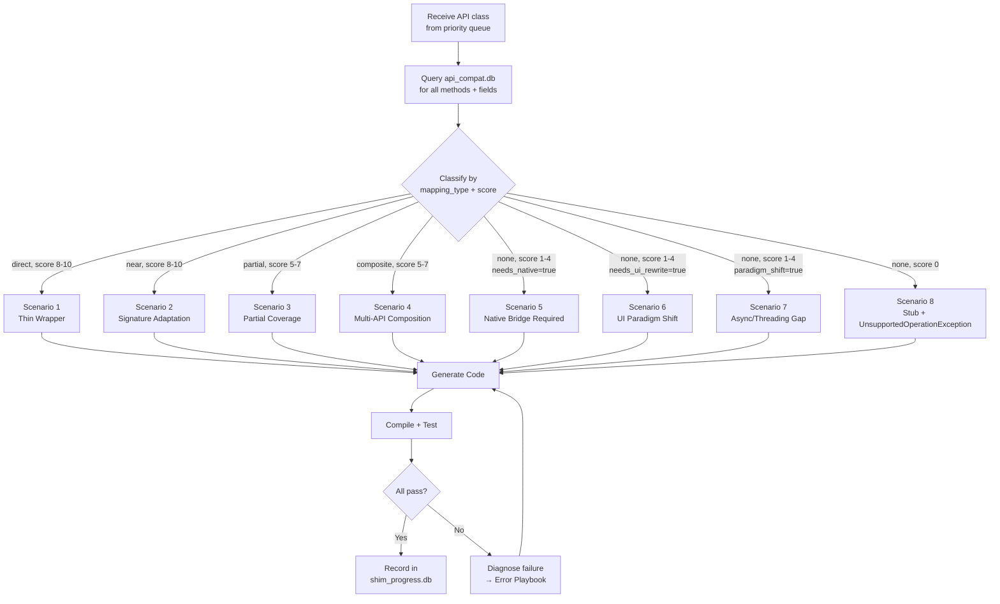
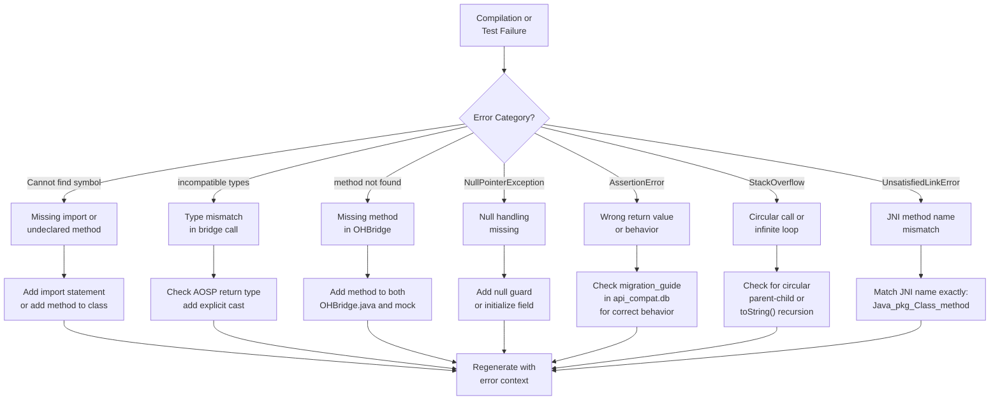

# AI Agent Playbook: Per-API Shim Generation

## Purpose

This document provides **scenario-by-scenario instructions** for an AI coding agent generating Android→OHOS shim code. For each API pattern the agent encounters, it specifies: what to generate, how to test, what pitfalls to watch for, and how to self-correct.

The existing `02-SHIM-BUILD-PLAN.md` describes the *what* and *when*. This playbook describes the *how* — the detailed decision tree an AI agent follows for every API it touches.

---

## Decision Tree: What to Do for Each API



---

## Scenario 1: Direct Mapping (Thin Wrapper)

**When:** `mapping_type = 'direct'`, `score >= 8`, `return_type_match = true`, `param_compatibility >= 0.9`

**What the agent sees in the DB:**
```
android.util.Log.d(String, String) → hilog.debug(domain, tag, format)  score=9  direct
```

**What to generate:**

1. **Java shim class** — delegates to `OHBridge.nativeXxx()`:
```java
package android.util;
import com.ohos.shim.bridge.OHBridge;

public class Log {
    public static int d(String tag, String msg) {
        OHBridge.logDebug(tag, msg);
        return 0;
    }
    // ... all 10 log methods
}
```

2. **OHBridge declaration** — add `static native` method:
```java
public static native void logDebug(String tag, String msg);
```

3. **Mock OHBridge** — in-memory mock for JVM tests:
```java
public static void logDebug(String tag, String msg) {
    System.out.println("D/" + tag + ": " + msg);
}
```

4. **Test case** — in HeadlessTest.java:
```java
static void testLog() {
    // Should not throw
    Log.d("TestTag", "debug message");
    Log.i("TestTag", "info message");
    Log.w("TestTag", "warning");
    Log.e("TestTag", "error");
    Log.v("TestTag", "verbose");
    Log.wtf("TestTag", "what a terrible failure");
    // Test with null
    Log.d(null, "null tag");
    Log.d("Tag", null);
    pass("Log.d/i/w/e/v/wtf");
}
```

**Pitfalls:**
- Null arguments: Android Log tolerates null tag/msg, shim must too
- Return value: Android Log.d returns int (bytes written), shim returns 0 (mock)
- Thread safety: Log must be safe to call from any thread

**Self-correction triggers:**
| Error | Fix |
|-------|-----|
| `NullPointerException` in mock | Add null guard in mock implementation |
| Return type mismatch | Check AOSP return type, match exactly |
| Missing overload | Check all overloads (tag+msg, tag+msg+throwable) |

**Test level:** Level 1 (Mock) only. No OHOS runtime needed.

**Expected iterations:** 1 (first attempt succeeds >95% of the time)

---

## Scenario 2: Signature Adaptation (Near Mapping)

**When:** `mapping_type = 'near'`, `score >= 8`, `param_compatibility >= 0.7`

**What the agent sees:**
```
android.os.SystemClock.elapsedRealtime() → systemDateTime.getUptime(MILLISECONDS)
score=9  near  gap: "OH returns Promise, Android returns long"
```

**Key difference from Scenario 1:** Parameter order, type, or count differs. May need type conversion.

**What to generate:**

1. **Java shim** — converts types at the boundary:
```java
package android.os;
import com.ohos.shim.bridge.OHBridge;

public class SystemClock {
    public static long elapsedRealtime() {
        // OH systemDateTime.getUptime returns milliseconds
        return OHBridge.getUptimeMillis();
    }
    public static long uptimeMillis() {
        return OHBridge.getUptimeMillis();
    }
}
```

2. **Adaptation patterns** by type:

| Android Type | OH Type | Conversion Code |
|---|---|---|
| `int` color `0xFFRRGGBB` | `string` `'#AARRGGBB'` | `String.format("#%08X", color)` |
| `float` dp | `number` vp | `(float) dpValue` (1:1 on standard density) |
| `Enum` (int constants) | `string` enum | switch/map lookup |
| `long` timestamp ms | `number` timestamp ms | `(long) value` |
| `byte[]` | `Uint8Array` | bridge handles buffer copy |
| `Parcelable` | `Record<string, Object>` | JSON serialization via bridge |

3. **Test case** — validates type conversion correctness:
```java
static void testSystemClock() {
    long t1 = SystemClock.elapsedRealtime();
    assert t1 >= 0 : "elapsedRealtime should be non-negative";
    long t2 = SystemClock.elapsedRealtime();
    assert t2 >= t1 : "elapsedRealtime should be monotonically increasing";
    // In mock: returns System.nanoTime() / 1_000_000
    pass("SystemClock.elapsedRealtime");
}
```

**Pitfalls:**
- Integer overflow: Android uses int for many values where OH uses number (double)
- Color format: Android ARGB int vs OH `#AARRGGBB` string or `Color.XXX` enum
- Density: dp/sp/vp units may differ across devices; default to 1:1

**Self-correction triggers:**
| Error | Fix |
|-------|-----|
| `ClassCastException` | Check actual return type from bridge, add explicit cast |
| Wrong value range | Check if OH returns seconds vs milliseconds, multiply/divide |
| Missing constant | Add constant field to shim class matching AOSP value |

**Test level:** Level 1 (Mock).

**Expected iterations:** 1-2

---

## Scenario 3: Partial Coverage

**When:** `mapping_type = 'partial'`, `score 5-7`, some methods have no OH equivalent

**What the agent sees:**
```
android.net.ConnectivityManager
  - getActiveNetworkInfo() → connection.getDefaultNet()  score=7  partial
  - getNetworkCapabilities() → connection.getNetCapabilities()  score=6  partial
  - registerNetworkCallback() → connection.on('netAvailable')  score=5  composite
  - requestNetwork() → NO EQUIVALENT  score=2  none
  - bindProcessToNetwork() → NO EQUIVALENT  score=1  none
```

**Decision rule:** Implement methods with score >= MIN_SCORE. Stub the rest.

**What to generate:**

1. **Java shim** — working methods + stubs:
```java
package android.net;
import com.ohos.shim.bridge.OHBridge;

public class ConnectivityManager {
    // SHIMMED: score >= 5
    public NetworkInfo getActiveNetworkInfo() {
        boolean connected = OHBridge.isNetworkConnected();
        int type = OHBridge.getNetworkType(); // 0=none, 1=wifi, 2=cellular
        return new NetworkInfo(type, connected);
    }

    public void registerDefaultNetworkCallback(ConnectivityManager.NetworkCallback cb) {
        OHBridge.registerNetworkCallback(cb);
    }

    // STUBBED: score < 5, no OH equivalent
    public boolean requestNetwork(NetworkRequest req, NetworkCallback cb) {
        throw new UnsupportedOperationException(
            "ConnectivityManager.requestNetwork not supported on OHOS. "
            + "Use connection.getDefaultNet() instead."
        );
    }

    public boolean bindProcessToNetwork(Network network) {
        // No-op on OHOS — all network traffic uses default route
        return true;
    }
}
```

2. **Stub strategy decision table:**

| Stub Behavior | When to Use | Example |
|---|---|---|
| `throw UnsupportedOperationException` | API has no equivalent AND app would break silently if ignored | `requestNetwork()` |
| Return safe default (no-op) | API has no equivalent BUT safe to ignore | `bindProcessToNetwork()` → return true |
| Return empty/null | Query API with no data source | `getNetworkCapabilities()` on unsupported network |
| Log warning + no-op | Informational API | `reportNetworkConnectivity()` |

3. **Test case** — test working methods AND verify stubs behave predictably:
```java
static void testConnectivityManager() {
    ConnectivityManager cm = new ConnectivityManager();

    // Working methods
    NetworkInfo info = cm.getActiveNetworkInfo();
    assert info != null : "getActiveNetworkInfo should return non-null";

    // Stubbed methods — verify they throw or return defaults
    try {
        cm.requestNetwork(null, null);
        fail("requestNetwork should throw UnsupportedOperationException");
    } catch (UnsupportedOperationException e) {
        pass("requestNetwork throws as expected");
    }

    assert cm.bindProcessToNetwork(null) == true : "bindProcessToNetwork returns true (no-op)";
}
```

**Pitfalls:**
- Don't stub silently. Always log or throw — silent stubs cause impossible-to-debug issues later.
- Check if the app actually CALLS the stubbed method. If it's in an unused code path, a stub is fine. If it's in the critical path, flag for human review.
- Document every stub in the class javadoc with the OH migration alternative.

**Self-correction triggers:**
| Error | Fix |
|-------|-----|
| Test expects non-null from stubbed method | Change stub from throw to return empty/default |
| Test catches wrong exception type | Check what Android would throw, use same type |
| Method missing from shim | Check AOSP source for all public methods, add stubs |

**Test level:** Level 1 (Mock) + Level 2 (Headless) for working methods.

**Expected iterations:** 2-3

---

## Scenario 4: Multi-API Composition (Composite Mapping)

**When:** `mapping_type = 'composite'`, `score 5-7`, one Android API requires multiple OH API calls

**What the agent sees:**
```
android.content.Intent.<init>(Context, Class)
  → OH: new Want() + set bundleName + set abilityName
  score=6  composite  gap: "Intent maps to Want but extras→wantParams requires restructuring"
```

**What to generate:**

1. **Java shim with adapter logic:**
```java
package android.content;
import com.ohos.shim.bridge.OHBridge;
import java.util.HashMap;
import java.util.Map;

public class Intent {
    private String action;
    private String targetClass;
    private String targetPackage;
    private Map<String, Object> extras = new HashMap<>();
    private int flags;

    // Constructor: Intent(Context, Class<?>) → Want with bundleName + abilityName
    public Intent(Context context, Class<?> cls) {
        this.targetPackage = context.getPackageName();
        this.targetClass = cls.getName();
    }

    // Constructor: Intent(String action)
    public Intent(String action) {
        this.action = action;
    }

    // Extras → wantParams mapping
    public Intent putExtra(String name, String value) {
        extras.put(name, value);
        return this;
    }
    public Intent putExtra(String name, int value) {
        extras.put(name, value);
        return this;
    }
    public Intent putExtra(String name, boolean value) {
        extras.put(name, value);
        return this;
    }

    public String getStringExtra(String name) {
        Object v = extras.get(name);
        return v instanceof String ? (String) v : null;
    }
    public int getIntExtra(String name, int defaultValue) {
        Object v = extras.get(name);
        return v instanceof Integer ? (Integer) v : defaultValue;
    }

    // Bridge method: convert to OH Want structure
    public Map<String, Object> toWantParams() {
        Map<String, Object> want = new HashMap<>();
        if (targetPackage != null) want.put("bundleName", targetPackage);
        if (targetClass != null) want.put("abilityName", targetClass);
        if (action != null) want.put("action", mapAction(action));
        if (!extras.isEmpty()) want.put("parameters", new HashMap<>(extras));
        return want;
    }

    // Android action → OH action mapping
    private String mapAction(String androidAction) {
        switch (androidAction) {
            case "android.intent.action.VIEW": return "ohos.want.action.viewData";
            case "android.intent.action.SEND": return "ohos.want.action.sendData";
            case "android.intent.action.MAIN": return "ohos.want.action.home";
            case "android.intent.action.DIAL": return "ohos.want.action.dial";
            default: return androidAction; // pass through custom actions
        }
    }
}
```

2. **Composition patterns to know:**

| Android Pattern | OH Equivalent | Composition Strategy |
|---|---|---|
| `Intent` + extras | `Want` + `wantParams` | Map extras to params, map actions |
| `Activity.startActivityForResult()` | `UIAbility.startAbilityForResult()` | Wrap callback in Promise |
| `ContentResolver.query()` + Cursor | `DataShareHelper.query()` + ResultSet | Adapt predicates + column names |
| `AlarmManager.setExact()` | `reminderAgentManager.publishReminder()` | Build ReminderRequest from alarm params |
| `PendingIntent.getActivity()` | `WantAgent.getWantAgent()` | Build WantAgentInfo from Intent |
| `BroadcastReceiver` + IntentFilter | `commonEventManager.subscribe()` | Map filter actions to event names |

3. **Test case** — validates the composition logic:
```java
static void testIntentComposition() {
    // Constructor with target
    Intent i = new Intent(mockContext, TargetActivity.class);
    i.putExtra("userId", "abc123");
    i.putExtra("count", 42);

    Map<String, Object> want = i.toWantParams();
    assert want.get("bundleName").equals("com.test.app");
    assert want.get("abilityName").equals("TargetActivity");
    Map<String, Object> params = (Map<String, Object>) want.get("parameters");
    assert params.get("userId").equals("abc123");
    assert params.get("count").equals(42);

    // Action mapping
    Intent viewIntent = new Intent("android.intent.action.VIEW");
    assert viewIntent.toWantParams().get("action").equals("ohos.want.action.viewData");
}
```

**Pitfalls:**
- Intent flags (FLAG_ACTIVITY_NEW_TASK, etc.) have no direct OH equivalent — must map to launchType
- Bundle/extras nested objects: Android supports Parcelable bundles inside bundles
- URI data on Intent: `setData(Uri)` maps to `want.uri`
- Implicit intents (no target class): OH uses "skills" matching, not intent-filter

**Self-correction triggers:**
| Error | Fix |
|-------|-----|
| Missing extras method overload | Add all overloads: String, int, long, float, double, boolean, Serializable, Parcelable, Bundle |
| Action string not mapped | Add to switch statement, check if OH has equivalent or pass-through |
| Type mismatch in params | Ensure extras are serializable to JSON-compatible types |

**Test level:** Level 1 (Mock) + Level 2 (Headless for lifecycle tests).

**Expected iterations:** 2-3

---

## Scenario 5: Native Bridge Required

**When:** `needs_native = true`, `score 3-7`, OH API only accessible via C/C++ NDK

**What the agent sees:**
```
android.os.Build.MANUFACTURER → deviceInfo.manufacture  score=8  direct  needs_native=true
android.os.Build.MODEL → deviceInfo.productModel  score=8  direct  needs_native=true
```

**What to generate:**

1. **Java shim** with JNI-delegating fields:
```java
package android.os;
import com.ohos.shim.bridge.OHBridge;

public class Build {
    public static final String MANUFACTURER = OHBridge.getDeviceManufacturer();
    public static final String MODEL = OHBridge.getDeviceModel();
    public static final String BRAND = OHBridge.getDeviceBrand();
    public static final String DEVICE = OHBridge.getDeviceType();
    public static final String PRODUCT = OHBridge.getProductName();
    public static final String DISPLAY = OHBridge.getDisplayVersion();
    public static final int SDK_INT = OHBridge.getSdkApiVersion();

    // Inner class
    public static class VERSION {
        public static final String RELEASE = OHBridge.getOsFullName();
        public static final int SDK_INT = Build.SDK_INT;
    }
}
```

2. **OHBridge declarations:**
```java
// In OHBridge.java
public static native String getDeviceManufacturer();
public static native String getDeviceModel();
public static native String getDeviceBrand();
public static native int getSdkApiVersion();
```

3. **Mock OHBridge:**
```java
// In mock/OHBridge.java
public static String getDeviceManufacturer() { return "MockManufacturer"; }
public static String getDeviceModel() { return "MockModel"; }
public static String getDeviceBrand() { return "MockBrand"; }
public static int getSdkApiVersion() { return 10; }
```

4. **Rust bridge module** (when targeting real OHOS):
```rust
// shim/bridge/rust/src/device_info.rs
use jni::JNIEnv;
use jni::objects::JClass;
use jni::sys::jstring;

#[no_mangle]
pub extern "C" fn Java_com_ohos_shim_bridge_OHBridge_getDeviceManufacturer(
    env: JNIEnv, _class: JClass
) -> jstring {
    // Call OH NDK: #include "deviceinfo.h"
    // const char* mfr = OH_GetDeviceType(); // or similar
    let result = "OpenHarmony"; // placeholder
    env.new_string(result).unwrap().into_inner()
}
```

**Critical: Bridge type marshalling rules:**

| Java→JNI→Rust Direction | Rule |
|---|---|
| `String` → `jstring` | Use `env.get_string()`, handle UTF-8 |
| `null` String | Return `env.new_string("")` or `JObject::null()` |
| `int` → `jint` | Direct cast i32 |
| `byte[]` → `jbyteArray` | Use `env.convert_byte_array()`, manage lifecycle |
| `Object` → `jobject` | Must create Java object via JNI `new_object()` |
| Callback → `jobject` | Store as GlobalRef, invoke via `call_method()` |

**Pitfalls:**
- Static final fields initialized from native: If JNI fails, fields are null → NPE everywhere
- JNI thread safety: `JNIEnv` is per-thread, never share across threads
- Memory: JNI local refs are limited (~512), use `DeleteLocalRef` in loops
- OH NDK headers may not be available in all products — check `prebuilts/`

**Self-correction triggers:**
| Error | Fix |
|-------|-----|
| `UnsatisfiedLinkError` | Check native method name matches JNI convention exactly |
| `NullPointerException` from static field | Add fallback default in static initializer |
| Build error in Rust | Check JNI crate version, ensure correct target triple |

**Test level:** Level 1 (Mock) for JVM, Level 3 (QEMU) for real native calls.

**Expected iterations:** 2-4

---

## Scenario 6: UI Paradigm Shift

**When:** `needs_ui_rewrite = true`, class is in `android.widget.*` or `android.view.*`

**What the agent sees:**
```
android.widget.Button → ArkUI Button component  score=3  none
  needs_ui_rewrite=true  paradigm_shift=true
  gap: "Imperative (new Button, setText, setOnClick) vs declarative (Button('text').onClick())"
```

**Strategy: View Description Tree**

The shim does NOT create real UI. It builds a data structure (ViewTree) that an ArkUI renderer can read.

**What to generate:**

1. **Java shim** — captures properties into ViewNode:
```java
package android.widget;
import android.view.View;

public class Button extends TextView {
    public Button(android.content.Context context) {
        super(context);
        getViewNode().setType("Button");
    }

    // All property setters inherited from TextView:
    // setText(), setTextColor(), setTextSize(), etc.
    // All from View: setOnClickListener(), setEnabled(), setVisibility(), etc.

    // The ViewNode accumulates: {type: "Button", text: "...", onClick: callback, ...}
}
```

2. **ViewNode data structure** (shared by all View subclasses):
```java
package android.view;

public class ViewNode {
    private String type;           // "Button", "Text", "Column", etc.
    private Map<String, Object> props = new LinkedHashMap<>();
    private List<ViewNode> children = new ArrayList<>();
    private View.OnClickListener onClickListener;

    public void setProperty(String key, Object value) { props.put(key, value); }
    public void addChild(ViewNode child) { children.add(child); }

    // Serialize to JSON for bridge transport
    public String toJson() { /* recursive JSON serialization */ }
}
```

3. **Property mapping table** (the agent MUST follow this exactly):

| Android Setter | ViewNode Property Key | Value Type | ArkUI Equivalent |
|---|---|---|---|
| `setText(CharSequence)` | `"text"` | String | `.label('text')` or `Button('text')` |
| `setTextColor(int)` | `"fontColor"` | String `#AARRGGBB` | `.fontColor(color)` |
| `setTextSize(float)` | `"fontSize"` | Number (fp) | `.fontSize(n)` |
| `setBackgroundColor(int)` | `"backgroundColor"` | String `#AARRGGBB` | `.backgroundColor(color)` |
| `setVisibility(int)` | `"visibility"` | `"Visible"/"Hidden"/"None"` | `.visibility(...)` |
| `setPadding(l,t,r,b)` | `"padding"` | `{left,top,right,bottom}` | `.padding({...})` |
| `setWidth(int)` | `"width"` | Number (vp) or `"100%"` | `.width(n)` |
| `setHeight(int)` | `"height"` | Number (vp) or `"100%"` | `.height(n)` |
| `setEnabled(boolean)` | `"enabled"` | Boolean | `.enabled(b)` |
| `setAlpha(float)` | `"opacity"` | Number 0-1 | `.opacity(f)` |
| `setOnClickListener(l)` | `"onClick"` | callback ref | `.onClick(()=>...)` |

4. **Layout mapping** (containers):

| Android Container | ViewNode Type | ArkUI Component | Key Behavior |
|---|---|---|---|
| `LinearLayout(VERTICAL)` | `"Column"` | `Column()` | Children stacked vertically |
| `LinearLayout(HORIZONTAL)` | `"Row"` | `Row()` | Children arranged horizontally |
| `FrameLayout` | `"Stack"` | `Stack()` | Children overlay (z-order) |
| `ScrollView` | `"Scroll"` | `Scroll()` | Single child, scrollable |
| `RecyclerView` | `"List"` | `List() { LazyForEach }` | Virtualized, needs data source |
| `RelativeLayout` | `"RelativeContainer"` | `RelativeContainer()` | Constraint-based |

5. **Headless ArkUI test** (C++ gtest):
```cpp
// view_shim_button_test.cpp
TEST_F(ViewShimTest, ButtonCreationWithText) {
    auto frameNode = CreateButtonNode("Click Me");
    ASSERT_NE(frameNode, nullptr);
    auto pattern = frameNode->GetPattern<ButtonPattern>();
    ASSERT_NE(pattern, nullptr);
    // Verify text propagation
    auto textChild = frameNode->GetFirstChild();
    ASSERT_NE(textChild, nullptr);
}

TEST_F(ViewShimTest, ButtonOnClickCallback) {
    bool clicked = false;
    auto frameNode = CreateButtonNode("Test");
    // Simulate click gesture
    auto gestureHub = frameNode->GetOrCreateGestureEventHub();
    gestureHub->ActClick();
    // Verify callback fired (via mock)
}
```

**Pitfalls:**
- `match_parent` / `wrap_content`: Android's layout params don't map 1:1 to ArkUI
  - `match_parent` → `.width('100%')` or `.layoutWeight(1)`
  - `wrap_content` → omit width/height (ArkUI defaults to fit-content)
- `layout_weight` in LinearLayout → `flexGrow` in Row/Column
- `gravity` vs `layout_gravity`: child alignment vs self alignment
- `RecyclerView.Adapter`: paradigm shift — must become a data source for `LazyForEach`
- View IDs: `R.id.xxx` → not applicable in ArkUI (use @State binding)
- `findViewById()`: does not exist in ArkUI — captured state is the source of truth

**Self-correction triggers:**
| Error | Fix |
|-------|-----|
| Layout mismatch (wrong size) | Check match_parent/wrap_content mapping |
| Child not rendered | Check addView() stores child in ViewNode.children |
| Click not firing | Check onClick callback stored in ViewNode, not lost |
| Stack overflow in toJson | Check for circular parent-child references |

**Test level:** Level 1 (Mock ViewNode creation) + Level 2 (Headless ArkUI component tests).

**Expected iterations:** 3-5

---

## Scenario 7: Async/Threading Paradigm Gap

**When:** `paradigm_shift = true`, Android uses sync/callback pattern, OH uses Promise/async

**Common cases:**
- `android.os.Handler` / `Looper` (thread message queue) → OH `TaskPool` / `EventRunner`
- `android.os.AsyncTask` → OH `taskpool.execute()` or `Promise`
- `android.content.ContentResolver.query()` (sync) → OH `DataShareHelper.query()` (async)
- `android.media.MediaPlayer` (sync state machine) → OH `AVPlayer` (async state transitions)

**What to generate:**

1. **Handler/Looper shim** — the most critical async gap:
```java
package android.os;
import java.util.concurrent.*;

public class Handler {
    private final ExecutorService executor = Executors.newSingleThreadExecutor();
    private final BlockingQueue<Runnable> messageQueue = new LinkedBlockingQueue<>();

    public Handler() { startLoop(); }
    public Handler(Looper looper) { startLoop(); }

    public boolean post(Runnable r) {
        return messageQueue.offer(r);
    }

    public boolean postDelayed(Runnable r, long delayMillis) {
        executor.submit(() -> {
            try {
                Thread.sleep(delayMillis);
                r.run();
            } catch (InterruptedException e) {
                Thread.currentThread().interrupt();
            }
        });
        return true;
    }

    public void sendMessage(Message msg) {
        post(() -> handleMessage(msg));
    }

    public void handleMessage(Message msg) {
        // Subclasses override this
    }

    public void removeCallbacksAndMessages(Object token) {
        messageQueue.clear();
    }

    private void startLoop() {
        executor.submit(() -> {
            while (!Thread.currentThread().isInterrupted()) {
                try {
                    Runnable r = messageQueue.take();
                    r.run();
                } catch (InterruptedException e) {
                    break;
                }
            }
        });
    }
}
```

2. **AsyncTask shim** — wraps in executor:
```java
package android.os;
import java.util.concurrent.*;

public abstract class AsyncTask<Params, Progress, Result> {
    private static final ExecutorService EXECUTOR = Executors.newFixedThreadPool(4);

    public final AsyncTask<Params, Progress, Result> execute(Params... params) {
        onPreExecute();
        EXECUTOR.submit(() -> {
            try {
                Result result = doInBackground(params);
                // Post to main thread (simplified: just call directly in shim)
                onPostExecute(result);
            } catch (Exception e) {
                onCancelled();
            }
        });
        return this;
    }

    protected abstract Result doInBackground(Params... params);
    protected void onPreExecute() {}
    protected void onPostExecute(Result result) {}
    protected void onProgressUpdate(Progress... values) {}
    protected void onCancelled() {}
}
```

3. **Async-to-sync bridge pattern** (for OH Promise → Java blocking call):
```java
// In OHBridge mock:
public static String httpGet(String url) {
    // Real bridge: would call OH http.createHttp().request() which returns Promise
    // Bridge wraps: CompletableFuture + condition_variable in Rust
    // Mock: returns canned response
    return "{\"status\": \"ok\"}";
}
```

**Pitfalls:**
- Deadlock: If the Android code posts to Handler from the same thread that's waiting for the result
- Thread pool exhaustion: AsyncTask's default pool is 4 threads, some apps fire hundreds
- Looper.getMainLooper(): Must return a singleton; many Android apps rely on this
- Message.obtain() pool: Android recycles Message objects; shim should at minimum not crash
- Handler.Callback: Some apps use callback-style instead of subclassing

**Self-correction triggers:**
| Error | Fix |
|-------|-----|
| Deadlock in test | Add timeout to blocking calls, check thread model |
| `IllegalStateException: Looper not prepared` | Ensure Looper.prepare() is no-op or creates default |
| Message fields missing | Add `what`, `arg1`, `arg2`, `obj` fields to Message class |
| Callback not invoked | Check executor isn't shut down, check queue implementation |

**Test level:** Level 1 (Mock) with concurrency stress tests.

**Expected iterations:** 3-5

---

## Scenario 8: No Mapping (Stub)

**When:** `score = 0` or `score <= 2` with `mapping_type = 'none'`

**What to generate:** Minimal stub that doesn't crash the app.

```java
package android.renderscript;

public class RenderScript {
    public static RenderScript create(android.content.Context ctx) {
        android.util.Log.w("A2OH-SHIM",
            "RenderScript is not supported on OpenHarmony. " +
            "Consider using native compute (NDK) or WebAssembly.");
        return new RenderScript();
    }

    public void destroy() { /* no-op */ }

    // All methods are no-ops or throw
    public Allocation createAllocation() {
        throw new UnsupportedOperationException(
            "RenderScript.createAllocation not supported on OHOS");
    }
}
```

**Decision: throw vs no-op vs return-default:**

| Method Type | Strategy | Example |
|---|---|---|
| Lifecycle (create/destroy) | No-op, return dummy | `create()` returns empty instance |
| Computation (the actual work) | Throw | `createAllocation()` throws |
| Query (read state) | Return safe default | `isAvailable()` returns false |
| Setter (write state) | Log warning + no-op | `setParam()` logs and ignores |
| Listener registration | Store but never fire | `setCallback()` stores but no events |

**Test level:** Level 1 only (verify no crash, expected exceptions).

**Expected iterations:** 1

---

## Error Diagnosis Playbook

When compilation or tests fail, the agent must diagnose the category of error and apply the right fix:



### Error Feedback Prompt Template

When the agent needs to self-correct, append this to the original prompt:

```
## PREVIOUS ATTEMPT FAILED

### Compilation Error:
{stderr from javac}

### Test Failure:
{stdout from test runner, showing assertion failures}

### Error Category: {auto-detected category}

### Fix Guidance:
- {specific fix instruction based on error category}

### IMPORTANT:
- Do NOT rewrite the entire class from scratch
- Only fix the specific error
- Keep all existing working code unchanged
- Show the minimal diff needed
```

### Maximum Retry Strategy

| Iteration | Strategy |
|---|---|
| 1st attempt | Generate from template + DB context |
| 2nd attempt | Add compilation errors to prompt |
| 3rd attempt | Add test failures + migration_guide from DB |
| 4th attempt | Add existing working shim as reference pattern |
| 5th attempt | Flag for human review, move to next class |

---

## Per-Subsystem Cookbook

### Data Storage APIs

| Class | Scenario | Key Rule | Test Focus |
|---|---|---|---|
| `SharedPreferences` | S1 (Direct) | RULE-D6: `apply()` → `put()+flush()` | CRUD, null keys, concurrent access |
| `SharedPreferences.Editor` | S4 (Composite) | Chain pattern: `edit().putX().apply()` | Method chaining, commit vs apply |
| `SQLiteDatabase` | S2 (Near) | RULE-D1: `rawQuery()` → `querySql()` | CRUD, transactions, migrations |
| `SQLiteOpenHelper` | S4 (Composite) | RULE-D1: constructor+onCreate → getRdbStore | Version upgrades, open/close |
| `Cursor` | S2 (Near) | RULE-D3: `moveToFirst/Next` → `goToFirstRow/NextRow` | Iteration, column types, close |
| `ContentValues` | S1 (Direct) | RULE-D2: → plain object `{k:v}` | All value types, null values |
| `ContentProvider` | S4 (Composite) | RULE-D7: → DataShareExtensionAbility | URI matching, CRUD ops, registration |
| `ContentResolver` | S4 (Composite) | RULE-D8: → DataShareHelper | query/insert/update/delete |

### Lifecycle APIs

| Class | Scenario | Key Rule | Test Focus |
|---|---|---|---|
| `Activity` | S4 (Composite) | R1-R9: → UIAbility + Page | Lifecycle order, state save/restore |
| `Service` | S4 (Composite) | → ServiceExtensionAbility | Start/stop, binding, background |
| `BroadcastReceiver` | S4 (Composite) | → commonEventManager.subscribe() | Register/unregister, event matching |
| `Application` | S2 (Near) | → AbilityStage | Single init, global state |
| `Intent` | S4 (Composite) | → Want + wantParams | Action mapping, extras, URI data |
| `PendingIntent` | S4 (Composite) | → WantAgent | Get/cancel, immutable flags |

### Networking APIs

| Class | Scenario | Key Rule | Test Focus |
|---|---|---|---|
| `HttpURLConnection` | S4 (Composite) | → http.createHttp() | GET/POST, headers, response codes |
| `URL` | S2 (Near) | → string URL | Parsing, protocol, host, path |
| `ConnectivityManager` | S3 (Partial) | → connection module | Active network, callbacks, stubs |
| `WifiManager` | S3 (Partial) | → wifiManager module | State, scan, stub configuration |
| `Socket` | S4 (Composite) | → socket.constructTCPSocket() | Connect, read, write, close |
| `WebSocket` | S4 (Composite) | → webSocket.createWebSocket() | Connect, send, receive, close |

### Media APIs

| Class | Scenario | Key Rule | Test Focus |
|---|---|---|---|
| `MediaPlayer` | S7 (Async) | State machine: idle→prepared→playing | State transitions, error handling |
| `AudioManager` | S3 (Partial) | → audio.AudioManager | Volume, ringer mode, stubs |
| `MediaRecorder` | S7 (Async) | → AVRecorder with config | Record/stop/release |
| `SoundPool` | S4 (Composite) | → AudioRenderer | Load, play, unload |
| `Camera2` | S5 (Native) | → @ohos.multimedia.camera | Capture, preview, close |

### UI/Widget APIs

| Class | Scenario | Key Rule | Test Focus |
|---|---|---|---|
| `View` | S6 (UI) | → ViewNode base class | All common properties |
| `ViewGroup` | S6 (UI) | → ViewNode with children | addView, removeView, child iteration |
| `Button` | S6 (UI) | → Button component | text, onClick, enabled |
| `TextView` | S6 (UI) | → Text component | text, color, size, lines, ellipsis |
| `EditText` | S6 (UI) | → TextInput component | hint, inputType, text change |
| `ImageView` | S6 (UI) | → Image component | src, scaleType |
| `LinearLayout` | S6 (UI) | → Column/Row | orientation, weight, gravity |
| `FrameLayout` | S6 (UI) | → Stack | child overlay, alignment |
| `ScrollView` | S6 (UI) | → Scroll | single child, scroll position |
| `RecyclerView` | S6 (UI) | → List + LazyForEach | adapter→data source paradigm shift |
| `CheckBox` | S6 (UI) | → Checkbox | checked state, onChange |
| `Switch` | S6 (UI) | → Toggle | isOn state, onChange |
| `ProgressBar` | S6 (UI) | → Progress | value, indeterminate |

### Device/System APIs

| Class | Scenario | Key Rule | Test Focus |
|---|---|---|---|
| `Build` | S5 (Native) | → deviceInfo NDK | All fields populated |
| `SystemClock` | S2 (Near) | → systemDateTime | Monotonic, uptime |
| `Environment` | S3 (Partial) | → filesystem APIs | External storage, data dir |
| `TelephonyManager` | S3 (Partial) | → @ohos.telephony | Phone state, carrier, stubs |
| `SensorManager` | S4 (Composite) | → @ohos.sensor | Register/unregister, events |
| `LocationManager` | S4 (Composite) | → @ohos.geoLocationManager | Last known, updates, permission |
| `Vibrator` | S2 (Near) | → @ohos.vibrator | Vibrate, cancel |
| `PowerManager` | S3 (Partial) | → screenLock module | Wake lock stubs |

---

## Quality Gates

Before the agent marks a class as "done", it must pass ALL applicable gates:

### Gate 1: Compilation (mandatory)
```bash
javac -source 8 -target 8 \
  -sourcepath shim/java:test-apps/mock \
  -d build/classes \
  shim/java/android/.../*.java
```
- Zero compilation errors
- Zero warnings about deprecated or unsafe operations

### Gate 2: API Surface Completeness
```
For each public method in AOSP's version of this class:
  - If score >= MIN_SCORE: method must be implemented (not just stubbed)
  - If score < MIN_SCORE: method must exist as stub (throw or no-op)
  - No method may be missing entirely
```

### Gate 3: Test Coverage
```
For each implemented (non-stub) method:
  - At least 1 test case that calls it with valid input
  - At least 1 test case with edge case input (null, empty, boundary)
  - Return value or side effect verified by assertion
```

### Gate 4: No Regression
```
Run full test suite (not just new tests):
  - test_pass >= baseline_pass
  - test_fail <= baseline_fail + 2 (allow small mock tolerance)
```

### Gate 5: Mock Consistency
```
For each new OHBridge method:
  - Declaration exists in shim/java/.../OHBridge.java
  - Mock exists in test-apps/mock/.../OHBridge.java
  - Mock returns plausible values (not null unless explicitly testing null)
```

---

## Prompt Construction Algorithm

The agent (or `a2oh-loop.sh`) builds the prompt dynamically for each class:

```python
def build_prompt(android_class: str, min_score: int) -> str:
    # 1. Get all methods for this class from api_compat.db
    apis = db.query("""
        SELECT a.name, a.signature, a.kind,
               m.score, m.mapping_type, m.effort_level,
               m.gap_description, m.migration_guide,
               m.code_example_android, m.code_example_oh,
               m.needs_native, m.needs_ui_rewrite, m.paradigm_shift,
               oa.name as oh_name, oa.signature as oh_sig
        FROM api_mappings m
        JOIN android_apis a ON m.android_api_id = a.id
        ...
        WHERE class = ? AND a.kind IN ('method','constructor')
    """, android_class)

    # 2. Classify the dominant scenario
    scenario = classify_scenario(apis)

    # 3. Pick the right prompt template
    template = TEMPLATES[scenario]

    # 4. Enrich with DB fields
    prompt = template.format(
        class_name=android_class,
        api_table=format_api_table(apis),
        gap_descriptions=collect_gaps(apis),
        migration_guides=collect_guides(apis),
        code_examples=collect_examples(apis),
        existing_shim=read_file_if_exists(shim_path(android_class)),
        existing_bridge=read_file_if_exists(bridge_path(android_class)),
        dependent_shims=get_already_shimmed_deps(android_class),
        min_score=min_score,
        baseline_pass=get_baseline_pass(),
        baseline_fail=get_baseline_fail(),
    )

    # 5. If this is a retry, append error context
    if previous_error:
        prompt += ERROR_FEEDBACK_TEMPLATE.format(
            compilation_error=previous_stderr,
            test_failure=previous_stdout,
            error_category=diagnose_error(previous_stderr, previous_stdout),
        )

    return prompt
```

---

## Cost Estimation

| Scenario | Avg Tokens/Class | Avg Iterations | Est. Cost/Class |
|---|---|---|---|
| S1 Direct | 3,000 in + 2,000 out | 1.0 | ~$0.05 |
| S2 Near | 4,000 in + 3,000 out | 1.5 | ~$0.10 |
| S3 Partial | 5,000 in + 4,000 out | 2.5 | ~$0.25 |
| S4 Composite | 6,000 in + 5,000 out | 3.0 | ~$0.40 |
| S5 Native | 5,000 in + 4,000 out | 3.0 | ~$0.35 |
| S6 UI | 8,000 in + 6,000 out | 4.0 | ~$0.70 |
| S7 Async | 6,000 in + 5,000 out | 3.5 | ~$0.50 |
| S8 Stub | 2,000 in + 1,000 out | 1.0 | ~$0.03 |

**Total estimated cost for all ~130 classes:** ~$30-50

---

## Appendix: Database Query Reference

### Get all methods for a class with full mapping context
```sql
SELECT
    a.name AS method_name,
    a.signature,
    a.kind,
    m.score,
    m.mapping_type,
    m.effort_level,
    m.gap_description,
    m.migration_guide,
    m.code_example_android,
    m.code_example_oh,
    m.needs_native,
    m.needs_ui_rewrite,
    m.paradigm_shift,
    m.param_compatibility,
    m.return_type_match,
    oa.name AS oh_api_name,
    oa.signature AS oh_api_signature,
    om.name AS oh_module
FROM api_mappings m
JOIN android_apis a ON m.android_api_id = a.id
JOIN android_types t ON a.type_id = t.id
JOIN android_packages p ON t.package_id = p.id
LEFT JOIN oh_apis oa ON m.oh_api_id = oa.id
LEFT JOIN oh_types ot ON oa.type_id = ot.id
LEFT JOIN oh_modules om ON ot.module_id = om.id
WHERE p.name || '.' || t.full_name = 'android.content.SharedPreferences'
  AND a.kind IN ('method', 'constructor')
ORDER BY m.score DESC;
```

### Find classes ready for generation (not yet shimmed)
```sql
SELECT
    p.name || '.' || t.full_name AS fqn,
    COUNT(*) AS api_count,
    ROUND(AVG(m.score), 1) AS avg_score,
    SUM(CASE WHEN m.mapping_type IN ('direct','near') THEN 1 ELSE 0 END) AS feasible,
    SUM(CASE WHEN m.needs_native THEN 1 ELSE 0 END) AS native_count,
    SUM(CASE WHEN m.needs_ui_rewrite THEN 1 ELSE 0 END) AS ui_count,
    SUM(CASE WHEN m.paradigm_shift THEN 1 ELSE 0 END) AS async_count,
    GROUP_CONCAT(DISTINCT m.mapping_type) AS types,
    GROUP_CONCAT(DISTINCT m.effort_level) AS efforts
FROM api_mappings m
JOIN android_apis a ON m.android_api_id = a.id
JOIN android_types t ON a.type_id = t.id
JOIN android_packages p ON t.package_id = p.id
WHERE a.kind IN ('method', 'constructor')
  AND m.score >= 5
  AND (p.name || '.' || t.full_name) NOT IN (
      SELECT android_class FROM shim_progress WHERE status IN ('tested_mock','tested_device')
  )
GROUP BY fqn
HAVING feasible > 2
ORDER BY avg_score DESC, feasible DESC
LIMIT 20;
```

### Check which skill docs apply to a class
```sql
-- Map android package → skill document
SELECT CASE
    WHEN p.name LIKE 'android.database%' THEN 'A2OH-DATA-LAYER.md'
    WHEN p.name LIKE 'android.content.SharedPreferences%' THEN 'A2OH-DATA-LAYER.md'
    WHEN p.name IN ('android.app', 'android.content') THEN 'A2OH-LIFECYCLE.md'
    WHEN p.name LIKE 'android.net%' THEN 'A2OH-NETWORKING.md'
    WHEN p.name LIKE 'android.media%' THEN 'A2OH-MEDIA.md'
    WHEN p.name IN ('android.widget', 'android.view') THEN 'A2OH-UI-REWRITE.md'
    WHEN p.name LIKE 'android.os%' THEN 'A2OH-DEVICE-API.md'
    WHEN p.name LIKE 'android.telephony%' THEN 'A2OH-DEVICE-API.md'
    ELSE 'SHIM-INDEX.md'
END AS skill_doc
FROM android_packages p
WHERE p.name = 'android.content';
```
